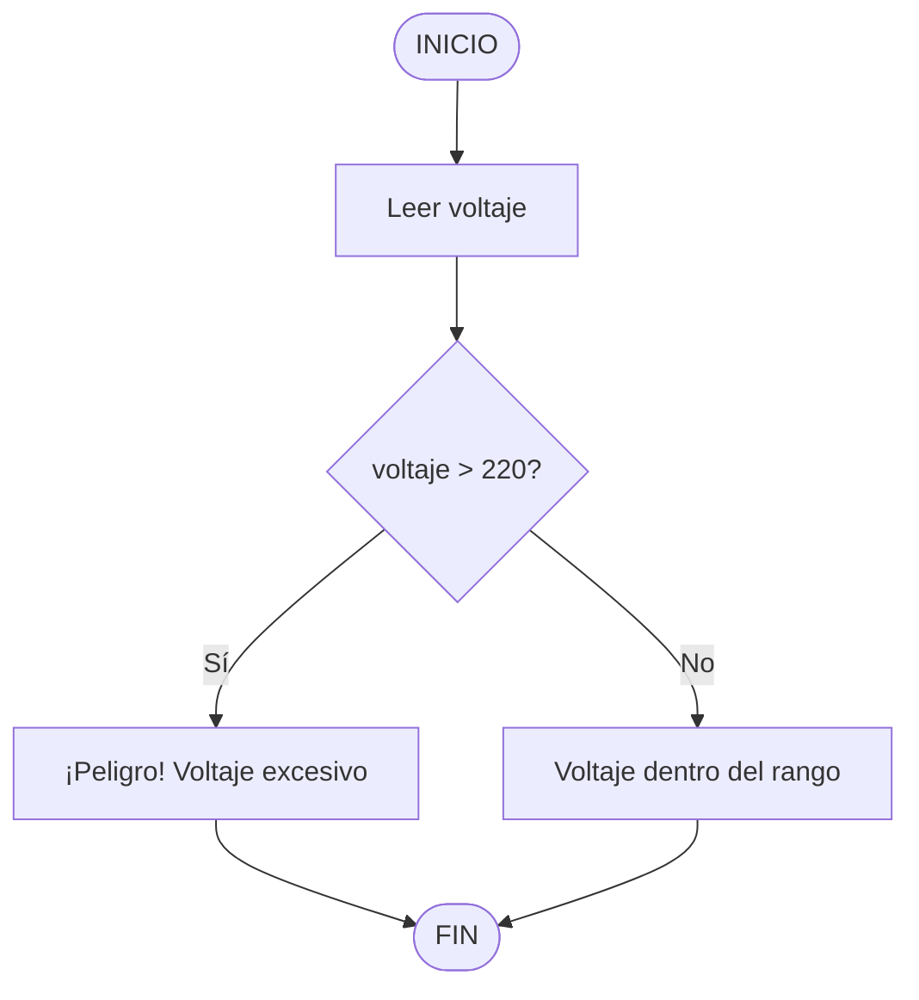

# Ejercicio 02: Algoritmo

## Pseudocódigo
```
INICIO
Leer voltaje
Si (voltaje > 220) entonces
Escribir "¡Peligro! Voltaje excesivo"
Sino
Escribir "Voltaje dentro del rango"
FinSi
FIN
```
## Diagrama de flujo

## Variables utilizadas

| Variable | Tipo | Descripción |
|:---|:---|:---|
| `voltaje` | Real (`float`) | Valor de voltaje medido |

## Explicación

1. El programa solicita al usuario un valor de voltaje.
2. Convierte el valor a número real (`float`).
3. Compara si el voltaje es mayor a 220.
4. Si es verdadero, muestra el mensaje de peligro.
5. Si es falso, muestra el mensaje de rango seguro.
