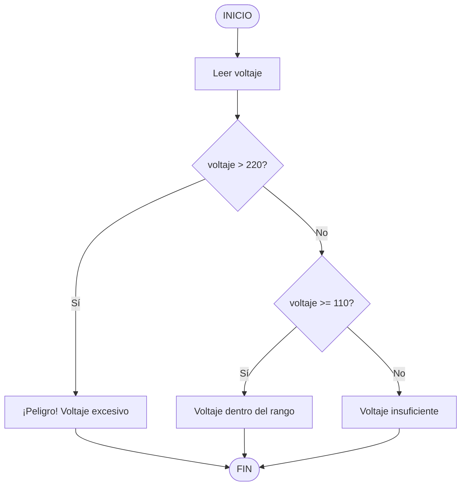

# Ejercicio 03: Algoritmo

## Pseudocódigo
```
INICIO
Leer voltaje
Si (voltaje > 220) entonces
Escribir "¡Peligro! Voltaje excesivo"
Sino Si (voltaje >= 110) entonces
Escribir "Voltaje dentro del rango"
Sino
Escribir "Voltaje insuficiente"
FinSi
FIN
```

## Diagrama de flujo


### Variables utilizadas
| Variable | Tipo | Descripción |
|:---|:---|:---|
| `voltaje` | Real (`float`) | Valor de voltaje medido |

### Explicación
El programa solicita al usuario un valor de voltaje.

Compara si el voltaje es mayor a 220. Si es verdadero, muestra peligro.

Si no, compara si el voltaje es mayor o igual a 110. Si es verdadero, muestra rango.

Si ninguna de las anteriores es verdadera, muestra insuficiente.
