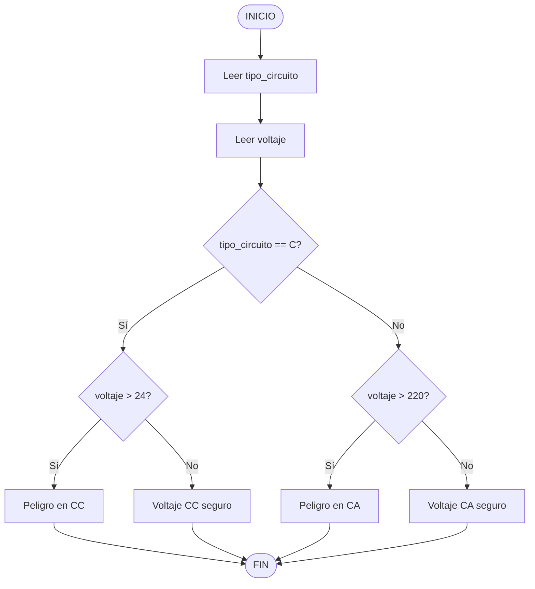

# Ejercicio 04: Algoritmo

## Pseudocódigo
```
INICIO
Leer tipo_circuito
Leer voltaje
Si (tipo_circuito == "C") entonces
Si (voltaje > 24) entonces
Escribir "Peligro en CC"
Sino
Escribir "Voltaje CC seguro"
FinSi
Sino
Si (voltaje > 220) entonces
Escribir "Peligro en CA"
Sino
Escribir "Voltaje CA seguro"
FinSi
FinSi
FIN
```

## Diagrama de flujo


## Variables utilizadas
| Variable | Tipo | Descripción |
|:---|:---|:---|
| `tipo_circuito` | Texto (`str`) | Tipo de circuito: "C" o "A" |
| `voltaje` | Real (`float`) | Valor de voltaje medido |

### Explicación
El programa solicita el tipo de circuito y el voltaje.

Si el tipo es "C", evalúa si el voltaje supera 24 V.

Si el tipo es "A", evalúa si el voltaje supera 220 V.

Muestra el mensaje correspondiente según el caso.
