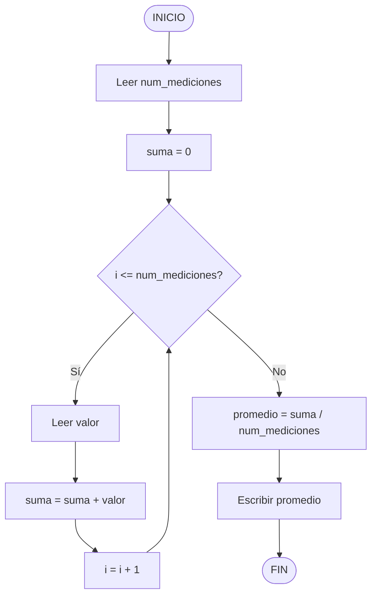

# Ejercicio 05: Algoritmo

## Pseudocódigo
```
INICIO
Leer num_mediciones
suma <- 0
Para i <- 1 Hasta num_mediciones Hacer
Leer valor
suma <- suma + valor
FinPara
promedio <- suma / num_mediciones
Escribir promedio
FIN
```

## Diagrama de flujo


## Variables utilizadas
| Variable | Tipo | Descripción |
|:---|:---|:---|
| `num_mediciones` | Entero (`int`) | Cantidad de mediciones a ingresar |
| `suma` | Real (`float`) | Acumulador de las mediciones |
| `valor` | Real (`float`) | Cada medición ingresada |
| `i` | Entero (`int`) | Contador del ciclo |
| `promedio` | Real (`float`) | Resultado final |

## Explicación
El programa solicita el número de mediciones.

1. Inicializa el acumulador suma en 0.

2. Repite num_mediciones veces:

3. Lee un valor.

4. Lo suma al acumulador.

5. Calcula el promedio dividiendo suma entre num_mediciones.

5. Muestra el promedio.
